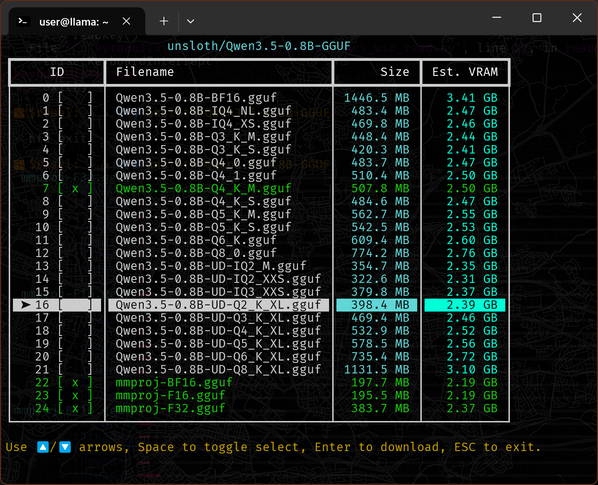
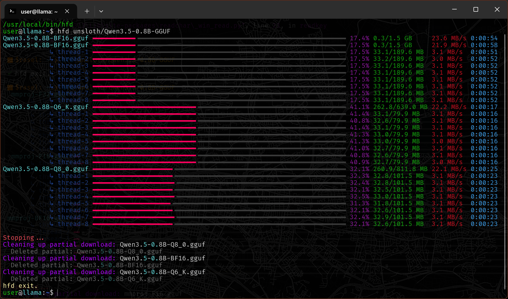

# HF-GGUF Downloader

A lightweight, no-nonsense Python script to download GGUF models from Hugging Face with **multi-threaded chunking** and a clean TUI for file selection.

### **Screenshot:** The Selection TUI


### **Screenshot:** **Active Multi-threaded Download**


### Features

* **Interactive TUI:** Select specific quants using arrow keys and space.
* **Parallel Downloads:** Downloads multiple files simultaneously.
* **Chunked Acceleration:** Each file is split into 8 threads for maximum bandwidth saturation.
* **VRAM Estimation:** Displays a rough estimate of how much VRAM you'll need for each quant.
* **Clean Exit:** Automatically wipes partial files if you `Ctrl+C`.

### Installation

**1. Install Dependencies**  
You need the official Hugging Face CLI and a couple packages.

```bash
pip install huggingface_hub httpx rich readchar
```
>  ⚠️ Fine, be a rebel. If you're skipping the virtual env on Ubuntu, add ` --break-system-packages` and Pray the Snake is merciful on your soul, because APT might not.

**2. Get the Script**  
Download `hfd.py`, make it executable, and move it to your path:

```bash
curl -sSL https://raw.githubusercontent.com/rsmahmud/hfd/main/hfd.py -o hfd.py
sudo chmod +x hfd.py && sudo mv hfd.py /usr/local/bin/hfd
```

### Usage

You can pass either a full Hugging Face URL or just the Repository ID.

**Interactive Selection TUI:**

```bash
hfd MaziyarPanahi/Llama-3.2-3B-Instruct-GGUF
```

**Direct Download:**

```bash
hfd https://hf.co/MaziyarPanahi/Llama-3.2-3B-Instruct-GGUF/blob/main/Llama-3.2-3B-Instruct.Q4_K_M.gguf
```

**Optional Environment Variables:**

* `HF_TOKEN`: Your Hugging Face token (required for gated models).
* `HF_LOCAL_DIR`: Set the download destination (default is `$HOME/models/`).

---

### License

**MIT**. Do whatever you want with it. Contributions, forks, and improvements are welcome.
